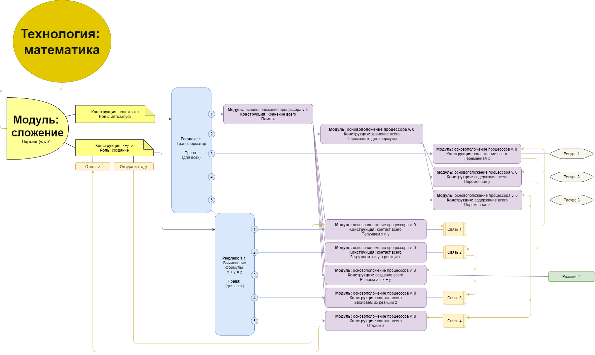

# CSDR порядок

[ русский язык | <a href="https://translate.google.com/translate?sl=ru&tl=zh-CN&u=https%3A%2F%2Fgithub.com%2Fit-architector%2Fprojecting.csdr%2Fblob%2Fmaster%2FREADME.md&result=%D0%9F%D0%BE%D0%BB%D1%83%D1%87%D0%B8%D1%82%D1%8C+%D0%BF%D0%B5%D1%80%D0%B5%D0%B2%D0%BE%D0%B4">用中文（表达</a> ]

<h3>Предисловие</h3>

CSDR порядок (**Conditions, Space, Distribution и Realization**) применим для любого языка программирования и позволяет создавать модульный код.

<h3>Навигация</h3>

Следует учесть несинхронность практики и теории, так как теория иногда писалась из практики, а практика из теории, и что то в итоге оставалось позади. В случае синхрона теории и практики получится стабильный порядок, отчего и будут переведены разделы "теория/практика" в один общий раздел "порядок".

> Теория (впереди):

1. <a href="#Код">Код</a>

2. <a href="#Модули">Модули</a>

    2.1. <a href="#Замысел">Замысел</a>
    
    2.2. <a href="#Потенциалы">Потенциалы</a>
    
    2.3. <a href="#Накопление">Накопление</a>
    
    2.4. <a href="#Стимул">Стимул</a>
    
    2.5. <a href="#Ранжировка">Ранжировка</a>
    
    2.6. <a href="#Содержание">Содержание</a>
    
    2.7. <a href="#Роли">Роли</a>
    
    2.8. <a href="#Примение">Примение</a>
    
    2.9. <a href="#Создание">Создание</a>
    
    2.10. <a href="#Выполнение">Выполнение</a>

3. <a href="#Процессор">Процессор</a>

    3.1. <a href="#Цикл">Цикл</a>
    
    3.2. <a href="#Функционал">Функционал</a>
    
    3.3. <a href="#Алгоритм-регуляции">Алгоритм регуляции</a>

> Практика (позади):
    
4. <a href="#Прототип-кода-на-PHP">Прототип кода на PHP</a>
    
    4.1. <a href="#Взаимодействие">Взаимодействие</a>
    
    4.2. <a href="#Многопоточность">Многопоточность</a>
    
    4.3. <a href="#Вариантность">Вариантность</a>
    
5. <a href="#Прототип-кода-на-JS">Прототип кода на JS</a>
    
    5.1. <a href="#Контроль">Контроль</a>
    
    5.2. <a href="#Многопоточность-1">Многопоточность</a>
    
    5.3. <a href="#Вариантность-1">Вариантность</a>
    
    5.4. <a href="#Навигация">Навигация</a>
    
    5.5. <a href="#реакция-pagespeed">Реакция pagespeed</a>
    
6. <a href="#ссылки">Ссылки</a>

<h2>Код</h2>

Код будет состоять из двух частей:
1. Модули, где проекты с проработанным api
2. Процессор, где функционал который выполнит модули 

<h2>Модули</h2>

<h3>Замысел</h3>

Замыслом проекта будет модуль и всё что требуется от заказчика, так это название модуля и перечисление необходимых конструкций в нём.

<h3>Потенциалы</h3>

По моим расчётам (и подсказкам таки еврейских братьев) наш мир 4-х-мерный: прошлое (наша опора), будущее (наша среда), объединяющее (таки да, торговля и подарки важны) и настоящее (наши дела). Основавшись на таких знаниях, и признав, что лучшего целостного кодирования, согласованного с ходом нашего времени, для моих устремлений не найти, я вычислил, что разрабатываемый код любого замысла (ядра, интерфейса, программы, сайта, модуля) нуждается в накоплении 4-х потенциалов: 

1. Права
2. Роли
3. Возможности
4. Способности

И ничего более, или менее.

<h3>Накопление</h3>

Для накопления потенциалов я выявил такие компоненты: Conditions, Space, Distribution и Realization. Зафиксируем их как международную аббревиатуру CSDR. 

Для удобства изъяснений, сделаю общую картину CSDR и его перевод:

1) Conditions, где копятся права -> <b>Рефлексы</b>

> При просмотре всех рефлексов мы можем понять какие внешние события код обрабатывает, по простому: для чего код существует.

2) Space, где копятся роли -> <b>Места</b>

> При просмотре мест мы можем понять какие у кода функции, оболочки, переменные и их значения.

3) Distribution, где копятся возможности -> <b>Связи</b>

> При просмотре связей мы можем понять как заполняется и куда поступают значения переменных.

4) Realization, где копятся способности -> <b>Реакции</b>

> При просмотре реакций мы можем понять логику кода.

<h3>Стимул</h3>

Для того, чтобы потенциалы накапливались введём ходовой компонент "<b>ресурс</b>".

<h3>Ранжировка</h3>

У каждого компонента (кроме замысла) каждая составляющая должна быть последовательно пронумерована. 
При этом конструкции, рефлексы и места из за своих особенностей (необходимости вложенности) должны выстраиваться гомоархически (со вложением друг в друга начиная от одного родителя), а вот связи, реакции и ресурсы гетерархично (последовательно, без вложений) для завязки на места.

<h3>Содержание</h3>

Чтобы каждый компонент и его составляющии смогли раскрыть себя полностью и быть применимыми на любом уровне кода, было выявлено необходимое содержание:

Для <b>замысла</b>:
1. Название, в им. падеже
2. Версия, где номер последней корректировки

Для <b>конструкций</b>:
1. <a href="#Роли">Роль</a>, где варианты ролей конструкции: хранение, содержание, создание и контроль
2. Назначение, где пожелание от замысла
3. Предпочтение, где пожелание от данной конструкции
4. Автозапуск, где отмечается дополнительный запуск данной конструкции в начале при запуске других конструкций
5. Условия, где последовательные id рефлексов принадлежащих данной конструкции
6. Контакты, где точки соприкосновения с конструкцией

Для <b>рефлексов</b>:
1. Ориентир, где назначение рефлекса
2. Расчёты, где устанавливается состав задач, обеспечивающих реализацию поставленных целей; уточняется характер взаимосвязи и их основные характеристики; определяются необходимые для решения задач функции обработки данных 
3. Сценарий, где последовательные id мест принадлежащих данной рефлексии
4. Права, где <a href="#алгоритм-регуляции">алгоритм регуляции</a>
5. Ожидание, где варианты ожидания получения прав на активацию: нет, единожды, множественно 
6. Вложение, где подкатегории рефлексов

Для <b>мест</b>:
1. Смысл, где назначение места
2. Модуль, где обозначение применённого модуля
3. Связь, где id связи принадлежащей данному месту или нет
4. Реакция, где id реакции принадлежащей данному месту или нет
5. Ресурс, где id ресурса принадлежащего данному месту или нет
6. Вложение, где подкатегории мест

Для <b>связей</b>:
1. Возможности, где массив для импорта значений

Для <b>реакций</b>:
1. Способность, где функция с алгоритмом или нет
2. Ресурсы, где место для размещения информации для функции
3. Результат, где место для результата из функции

Для <b>ресурсов</b>: 
1. Информация

<h3>Роли</h3>

Для того, чтобы конструкции были стыковычными между собой, были выявлены такие направления конструкций:
1. Хранение
- отвечает за вложение
2. Содержание
- отвечает за ресурсы
3. Создание
- отвечает за реакции
4. Контроль
- отвечает за связи

<h3>Примение</h3>

В каждом месте можно вызвать для выполнения определенный модуль, обозначив: {название модуля}, {назначение конструкции}. При этом, в местах можно вызвать выполнение конструкцию этого же модуля, обозначив {название модуля = @this}.

Пример вызова модулей (<a target="_blank" href="https://github.com/it-architector/code.csdr/blob/master/%D0%9A%D0%B0%D1%80%D1%82%D0%B8%D0%BD%D0%BA%D0%B8/Module.png?raw=true">открыть в отдельном окне</a>):

<h3>Создание</h3>

Для первоначального создания модулей введём модуль **процессор** с такими конструкциями:

1. Хранение: всего
> благодаря которой процессор сможет капсулировать роли
2. Содержание: всего
> благодаря которой процессор сможет запоминать информацию
3. Создание: всего
> благодаря которой процессор сможет выполнять логику
5. Контроль: передачи/получения в/из реакции
> благодаря которой процессор сможет взаимодействовать с реакциями
6. Контроль: передачи/получения в/из api
> благодаря которой процессор сможет взаимодействовать с другими процессорами

<h3>Выполнение</h3>

Для выполнения модулей применим процессор с нужным набором функций.

<h2>Процессор</h2>

<h3>Цикл</h3>
Код запускается в виде циклического процесса:

1. Рефлексы активируют места
2. Места активируют связи
3. Связи активируют реакции
4. Реакции активируют рефлексы
и т.д. с самого начала, до тех пор пока есть не активированные рефлексы.

<h3>Функционал</h3>

Выполнять вышеописанный цикл будет функция процессора, в которой будет такой сценарий:

1. **[по запросу: информация о рефлексе] [входящее: {id рефлекса}]** получение {тип рефлекса}, {алгоритм права}, {сценарий ролей}, {id вложенных рефлексов} в рефлексах
2. **[по запросу: проверка прав] [входящее: {алгоритм права}]** проверка успешного выполнения алгоритма права для мест
3. **[по запросу: память ожидания прав] [входящее: {запрос = добавить, проверить, удалить, получить всё}, {id ожидающего рефлекса}]** добавление {id рефлекса}, {алгоритм права} / получить всё {массива ожидания прав} / проверить / удаление в массиве "ожидания прав" у процессора
4. **[по запросу: проверка прав у ожидающих рефлексов]** запрос "*память ожидания прав: получить всё*"
    1. **[есть массив ожидания прав] [цикл]** последовательный запрос "*проверка прав*" по {массива ожидания прав}
        1. **[есть права]** запрос "*активация рефлекса*" с {id ожидающего рефлекса}
5. **[по запросу: информация о месте] [входящее: {id места}]** получение {тип места}, {команда}, {id реакции}, {id связи} в местах
6. **[по запросу: информация о реакции] [входящее: {id реакции}]** получение {тип реакции}, {обозначение роли}, {функция реакции}, {начальные данные}, {результативные данные}
7. **[по запросу: информация о связи] [входящее: {id связи}]** получение {тип связи}, {массив возможностей} в связях
8. **[по запросу: активация рефлекса] [входящее: {id рефлекса}]** запрос "*информация о рефлексе*"
    1. запрос "*проверка прав*"
    2. **[есть тип ожидание прав единожды / множественно]** запрос "*память ожидания прав: проверить*"
       1. **[нет наличия в массиве ожидания прав]** запрос "*память ожидания прав: добавить*"
       2. **[есть наличие в массиве ожидания прав] [есть права] [есть тип ожидание прав единожды]** запрос "*память ожидания прав: удалить*"
    3. **[есть права] [цикл]** последовательный запрос "*информация о месте*" у мест из {сценарий ролей}
       1. **[ориентация  = контроль]** запрос "*информация о связи*"
            1. запрос "*активация процессора*" с {код роли}, {параметры = массив возможностей}
       2. **[ориентация  = хранение]** запрос "*активация процессора*"
       3. **[ориентация  = содержимое]** запрос "*активация процессора*" с {параметры конструкции = вложение места}
       4. **[ориентация  = создание]** запрос "*информация о реакции*"
            1. **[есть функция]** получение {результативные данные} с функции с {параметры конструкции = начальные данные}
            2. **[нет функции]** получение {результативные данные} с запроса "*активация процессора*" с {параметры = начальные данные}
       5. запрос "*проверка прав у ожидающих рефлексов*"
    3. **[цикл]** последовательный запрос "*активация рефлекса*" с {id рефлекса} во вложении
9. **[по запросу: активация конструкции] [входящее: {конструкция}, {параметры конструкции}] [цикл]** последовательный запрос "*активация рефлекса*"
10. **[по запросу: активация процессора] [входящее: {модуль}, {конструкция}, {параметры конструкции}]** запрос "*активация конструкции*"
11. запрос "*активация процессора*"

<h3>Алгоритм регуляции</h3>

Алгоритм регуляции нужен для проверки прав активации рефлекса.

Общее представление: array('вместилище'=>array('вместилище'=>['значение 1','оператор','значение 2'],'вместилище'=>['значение 1','оператор','значение 2']))

> Где, вместилище: 
> 1. для обозначения условия - число
> 2. для обозначения сопоставления "OR" - 'variation'
> 3. для обозначения сопоставления "AND" - 'constant'
> 
> Где, значение 1 и 2: 
> 1. предполагаемое значение места
> 2. значение из места - '{place_id}'
> 3. текст
> 
> Где, оператор: 
> 1. равенство - '='
> 2. больше - '>'
> 3. равно либо больше - '>='
> 4. не равно - '!='
> 5. значение 1 есть в массиве значения 2 - 'in'
> 6. значения 1 нет в массиве значения 2 - 'not in'
> 7. частично равен - '=%'
> 
> При этом, вложенность может быть:
> 1. для одного условия: array('{число}'=>['{значение 1}','{оператор}','{значение 2}'])
> 2. много-вложенным: array('variation'=>array( '{число}'=>['{значение 1}','{оператор}','{значение 2}'], 'constant'=>array( '{число}'=>['{значение 1}','{оператор}','{значение 2}'], 'число'=>['{значение 1}','{оператор}','{значение 2}'] )))
> 
> 
> При этом, обозначения (variation, constant) могут содержать добавочно на конце цифру:
> 
>     'variation'=> array(
>
>     'constant_1'=>array('{число}'=>['{значение 1}','{оператор}','{значение 2}'],'{число}'=>['{значение 1}','{оператор}','{значение 2}']),
>
>     'constant_2'=>array('{число}'=>['значение 1}','{оператор}','{значение 2}'],'{число}'=>['{значение 1}','{оператор}','{значение 2}'])
>
>      )

<h2>Прототип кода на PHP</h2>

Для потверждения работоспособности порядка в ядре были наскоро собраны практические прототипы на PHP.

<h3>Взаимодействие</h3>

Установим цель такую: на внешний запрос ("x" и "y") выдать результат "z", рассчитанный по формуле x + y = z.

Спланируем проект (стрелками обозначим влияние / активацию):

<a href="https://www.youtube.com/watch?v=SW-4kUMS27M&feature=youtu.be">Видео планировки</a>

Результат: <a href="./PHP/Взаимодействие.php">Код взаимодействия</a> (<a href="https://framework-csdr.ru/samples/PHP/Взаимодействие.php?x=2&y=6">запустить вариант 2 + 6</a>).

<h3>Многопоточность</h3>

Ход работы: На вход дадим массив из вариантов "x" и "y" и последовательно выведем результат в ответ.

Результат: <a href="./PHP/Многопоточность.php">Код многопоточности</a> (<a href="https://framework-csdr.ru/samples/PHP/Многопоточность.php?data_x_y[1][x]=3&data_x_y[1][y]=7&data_x_y[2][x]=12&data_x_y[2][y]=5&data_x_y[3][x]=6&data_x_y[3][y]=6">запустить вариант (3 + 7, 12 + 5, 6 + 6)</a>).

<h3>Вариантность</h3>

Ход работы: На вход дадим переменную "kill" и в зависимости от её значения дадим ответ.

Результат: <a href="./PHP/Вариантность.php">Код вариантности</a> (<a href="https://framework-csdr.ru/samples/PHP/Вариантность.php?kill=false">запустить вариант kill=false</a>, <a href="https://framework-csdr.ru/samples/PHP/Вариантность.php?kill=true">вариант kill=true</a>).

<h2>Прототип кода на JS</h2>

Для потверждения работоспособности порядка в интерфейсе были наскоро собраны практические прототипы на JS.

<h3>Контроль</h3>

 - развёртка html
 - наполнение содержимым
 - установка стиля
 - установка favicon
 - смена текста по нажатию на тэг
 - показ подсказки по наведению (и отведению) на тэг

Результат: <a href="./JS/Контроль.html">Код контроля</a> (<a href="https://framework-csdr.ru/samples/JS/Контроль.html">открыть на хостинге</a>).

<h3>Многопоточность</h3>

Ход работы: На вход дадим массив с вариантами "id" и "текст" и последовательно на основе полученных данных выведем ссылки в браузер.

Результат: <a href="./JS/Многопоточность.html">Код многопоточности</a> (<a href="https://framework-csdr.ru/samples/JS/Многопоточность.html">открыть на хостинге</a>).

<h3>Вариантность</h3>

Ход работы: Выведем ссылки меню и в зависимости от "id" из браузера активируем открытую ссылку из меню.

Результат: <a href="./JS/Вариантность.html">Код вариантности</a> (<a href="https://framework-csdr.ru/samples/JS/Вариантность.html">открыть на хостинге</a>).

<h3>Навигация</h3>

Ход работы: Выведем ссылки меню и в зависимости от "id" из браузера активируем открытую ссылку из меню, без перезагрузки страницы, но меняя открытую ссылку в браузере.

Результат: <a href="./JS/Навигация.html">Код навигации</a> (<a href="https://framework-csdr.ru/samples/JS/Навигация.html">открыть на хостинге</a>).

<h3>Реакция pagespeed</h3>

Для тестирования у <a href="https://developers.google.com/speed/pagespeed/insights/?url=https%3A%2F%2Fframework-csdr.ru%2F">google pagespeed</a> была создана стандартная страница, со всеми графическим наворотами: https://framework-csdr.ru/index.html

Результат проверки:

<h2>Ссылки</h2>

Материал по теме: 

 <a target="_blank" href="https://www.youtube.com/watch?v=d7-Z0nZejYM">XP NRG: о бите и кубите</a> 

Проект поддерживают:

 <a target="_blank" href="https://www.jetbrains.com/?from=framework+csdr">JetBrains PhpStorm</a> 
