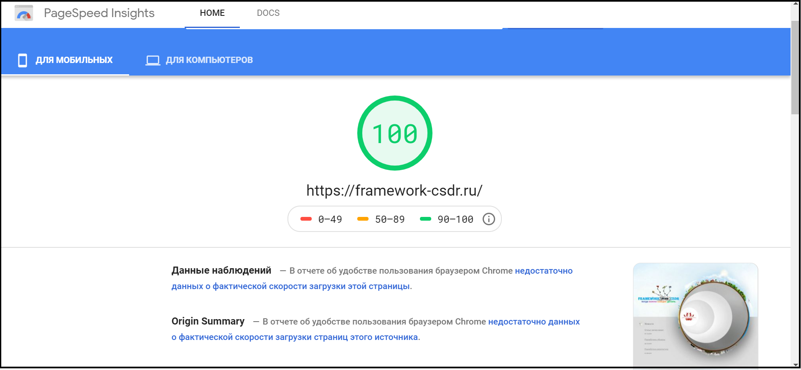

# Код CSDR

<h3>Предисловие</h3>

Применяя **CSDR** (Conditions, Space, Distribution и Realization) можно быть уверенным, что исходный код проекта будет конструктивным.


<h3>Навигация</h3>

1. <a href="#Проект">Проект</a>

    1.1. <a href="#Замысел">Замысел</a>
    
    1.2. <a href="#Потенциалы">Потенциалы</a>
    
    1.3. <a href="#Компоненты">Компоненты</a>
    
    1.4. <a href="#Содержание">Содержание</a>
    
    1.5. <a href="#Ранжировка">Ранжировка</a>
    
    1.6. <a href="#Активация">Активация</a>

    1.7. <a href="#Код">Код</a>
    
    1.8. <a href="#Роли">Роли</a>
    
2. <a href="#Образец-проектов-на-PHP">Образец проектов на PHP</a>

    2.1. <a href="#Роли-1">Роли</a>
    
    2.2. <a href="#Взаимодействие">Взаимодействие</a>
    
    2.3. <a href="#Многопоточность">Многопоточность</a>
    
    2.4. <a href="#Вариантность">Вариантность</a>
    
3. <a href="#Образец-проектов-на-JS">Образец проектов на JS</a>

    3.1. <a href="#Роли-2">Роли</a>
    
    3.2. <a href="#Контроль">Контроль</a>
    
    3.3. <a href="#Многопоточность-1">Многопоточность</a>
    
    3.4. <a href="#Вариантность-1">Вариантность</a>
    
    3.5. <a href="#Навигация">Навигация</a>
    
    3.6. <a href="#реакция-pagespeed">Реакция pagespeed</a>
    
3. <a href="#ссылки">Ссылки</a>


<h2>Проект</h2>

<h3>Замысел</h3>

Проект начинается с обозначения необходимых в нём конструкций (вам это знакомо из MVC как model). Для этого нужно обозначить назначение конструкции (например: форум, магазин, анимация при загрузке страницы) и предпочтения к конструкции. Так будет делаться у конструкций проекта: флажок начала работы (назначение) и флажок завершения работы (предпочтение). Собственно это всё, что нужно ожидать от заказчика.

<h3>Потенциалы</h3>

По моим расчётам (и подсказкам таки еврейских братьев) наш мир 4-х-мерный: прошлое (наша опора), будущее (наша среда), объединяющее (таки да, торговля и подарки важны) и настоящее (наши дела). Основавшись на таких знаниях, и признав, что лучшего целостного проектирования, согласованного с ходом нашего времени, для моих устремлений не найти, я вычислил, что разрабатываемый проект (ядро, интерфейс, программа, сайт) нуждается в накоплении 4-х потенциалов: 

1. Права
2. Роли
3. Возможности (и приобретения)
4. Способности

И ничего более, или менее.

<h3>Компоненты</h3>

Для накопления потенциалов я спроектировал такие компоненты: Conditions, Space, Distribution и Realization. Зафиксируем их как международную аббревиатуру CSDR. 


Для удобства изъяснений, сделаю общую картину проекта и его перевод:

1) Conditions, где создаются права проекта -> <b>Рефлексы</b>

> При просмотре всех рефлексов мы можем понять какие внешние события проект обрабатывает, по простому: для чего проект существует.


2) Space, где создаются роли проекта -> <b>Места</b>

> При просмотре мест мы можем понять какие у проекта функции, оболочки, переменные и их значения.


3) Distribution, где создаются возможности и приобретения проекта -> <b>Связи</b>

> При просмотре связей мы можем понять как заполняется и куда поступают значения переменных.


4) Realization, где создаются способности проекта -> <b>Реакции</b>

> При просмотре реакций мы можем понять логику проекта.

<h3>Содержание</h3>

Для каждого компонента так же было выявлено необходимое содержание, дабы каждый компонент смог раскрыть себя полностью и быть применим на любом уровне проекта.

Для <b>рефлексов</b>:
1. Ориентир, где обозначение рефлекса
2. Расчёты, где устанавливается состав задач, обеспечивающих реализацию поставленных целей; уточняется характер взаимосвязи и их основные характеристики; определяются необходимые для решения задач функции обработки данных 
3. Сценарий, где id мест для активации
4. Права, где код регуляции
5. Вложение, где подкатегории рефлексов


Для <b>мест</b>:
1. Смысл, где обозначение места
2. Роль, где назначение места (вы знакомы с этим в виде модулей по api технологии)
3. Связи, где id связей для активации
4. Вложение, где подкатегории мест / значения


Для <b>связей</b>:
1. Тип, где дальность связи / локальное, глобальное
2. Возможности, где id мест для импорта вложений
3. Приобретение, где id мест для экспорта вложений
4. Образец возможностей
5. Образец приобретения
6. Реакция, где id реакций для активации


Для <b>реакций</b>:
1. Способность, где алгоритмы

<h3>Ранжировка</h3>

Рефлексы и места из за своих особенностей (необходимости вложенности) должны выстраиваться гомоархически (в субъекты), а вот связи и реакции гетерархично (в объекты) по причине завязки на места.


<h3>Активация</h3>

При внешнем событии проект запускается в виде циклического процесса:

1. Рефлексы активируют места
2. Места активируют связи
3. Связи активируют реакции
4. Реакции активируют рефлексы
и т.д. с самого начала, до тех пор пока есть не активированные рефлексы.


<h3>Код</h3>

Код принято делать в виде соответствующих 6-и массивов:

```php
$project['Параметры']   = [...];
$project['Конструкции'] = [...];
$project['Рефлексы']    = [...];
$project['Места']       = [...];
$project['Связи']       = [...];
$project['Реакции']     = [...];
```

**Параметры** принято делать в готовом массиве:

```php
$project['Параметры'] = [
    'Название' => 'Название проекта',
    'Версия' => '{номер}.{bug fix}',
    'Технологии'  => ['{Технология 1}', '{Технология 2}']
];
```

> Где, название это название Вашего проекта.
> 
> Где, в версии {bug fix} это исправление ошибки в проекте под {номером}.
> 
> Где, технологии в массиве перечисляют требования к предустановленным технологиям устройства, на котором будет запущен проект.

**Конструкции** принято делать последовательно:

```php
$project['Конструкции'] = [
    '1' => [
        'Назначение'    => 'Назначение 1',
        'Предпочтение'  => 'Предпочтение 1',
        'Условия'       => ['{reflex_1}'],
    ],
    '2' => [
        'Назначение'    => 'Назначение 2',
        'Предпочтение'  => 'Предпочтение 2',
        'Условия'       => ['{reflex_1.1}','{reflex_1.1.1}','{reflex_1.1.2}'],
    ]
];
```

> Где, назначение это ключевое слово конструкции.
>
> При этом, id рефлексов добавляются в условия тогда, когда проектируются рефлексы.

> Где, предпочтение содержит всю информацию о необходимости конструкции.

> Где, условия это массив id рефлексов, которые созданы для конструкции.

**Рефлексы** принято делать со вложением:

```php
$project['Рефлексы'] = [
    '1' => [
        'Ориентир'   => 'Рефлекс 1',
        'Расчёты'    => 'Описание 1',
        'Сценарий'   => ['{place_id_1.1}','{place_id_1.2}'],
        'Права'      => 'Код условия 1',
        'Вложение'   => [
            '1.1' => [
                'Ориентир'   => 'Рефлекс 2',
                'Расчёты'    => 'Описание 2',
                'Сценарий'   => [['{place_id_3.2.1}' => '{reflex_1.1.1}'],'{place_id_3.2.2}'],
                'Права'      => 'Код условия 2',
                'Вложение'   => [
                     '1.1.1' => [
                           'Ориентир'   => 'Рефлекс 3',
                           'Расчёты'    => 'Описание 3',
                            'Сценарий'   => ['{place_id_4}'],
                            'Права'      => false,
                            'Вложение'   => false
                     ],
                ]
            ],
        ]
    ]
];
```

> Каждый вложенный рефлекс будет автоматически активан (запустится сценарий),  в зависимости от проверки прав.

> Где, в сценарии указываются id мест для последовательной активации: array({place_id_1}, {place_id_2}, {place_id_3}, ...).
>
> При этом, id мест добавляются в сценарий тогда, когда проектируются места, в нужной для этого последовательности.
>
> При этом, если у роли id места сценарий со вложением, то нужно указать id рефлекса в таком виде: array({place_id_1} => {reflex_id_3.2}).


> Где, в права можно добавить код условия (то что заключается в if) для активации сценария. 
> 
> Конструкция: array('вместилище'=>array('вместилище'=>['значение 1','оператор','значение 2'],'вместилище'=>['значение 1','оператор','значение 2']))
> 
> Где, вместилище: 
> 1. для обозначения условия - число
> 2. для обозначения сопоставления "OR" - 'variation'
> 3. для обозначения сопоставления "AND" - 'constant'
> 
> Где, значение 1 и 2: 
> 1. предполагаемое значение места
> 2. значение из места - '{place_id}'
> 3. текст
> 
> Где, оператор: 
> 1. равенство - '='
> 2. больше - '>'
> 3. равно либо больше - '>='
> 4. не равно - '!='
> 5. значение 1 есть в массиве значения 2 - 'in'
> 6. значения 1 нет в массиве значения 2 - 'not in'
>
>> где в п. 5 и п. 6 значение 2 может иметь: 
>> 1. текст
>> 2. варианты текстов в массиве
>>
>> При этом, текст может содержать в начале или конце знак "%", что будет означать любое кол-во символов
> 
> При этом, вложенность может быть:
> 1. для одного условия: array('число'=>['значение 1','оператор','значение 2'])
> 2. много-вложенным: array('variation'=>array( 'число'=>['значение 1','оператор','значение 2'], 'constant'=>array( 'число'=>['значение 1','оператор','значение 2'], 'число'=>['значение 1','оператор','значение 2'] )))
> 
> 
> При этом, обозначения (variation, constant) могут содержать добавочно на конце цифру:
> 
>     'variation'=> array(
>
>     'constant_1'=>array('число'=>['значение 1','оператор','значение 2'],'число'=>['значение 1','оператор','значение 2']),
>
>     'constant_2'=>array('число'=>['значение 1','оператор','значение 2'],'число'=>['значение 1','оператор','значение 2'])
>
>      )

**Места** принято делать со вложением:

```php
$project['Места']    = [
    '1' => [
        'Смысл'    => 'Описание 1',
        'Роль'     => ['Тип роли 1'=>['Название роли 1'=>'Команда роли 1']],
        'Связь'    => 'Наличие связи 1',
        'Вложение' => [
            '1.1' => [
                'Смысл'    => 'Описание 2',
                'Роль'     => ['Тип роли 2'=>['Название роли 2'=>'Команда роли 2']],
                'Связь'    => 'Наличие связи 2',
                'Вложение' => [
                    '1.1.1' => [
                        'Смысл'    => 'Описание 3',
                        'Роль'     => ['Тип роли 3'=>['Название роли 3'=>'Команда роли 3']],
                        'Связь'    => 'Наличие связи 3',
                        'Вложение' => false,
                     ],
                    '1.1.2' => [
                        'Смысл'    => 'Описание 4',
                        'Роль'     => ['Тип роли 4'=>['Название роли 4'=>'Команда роли 4']],
                        'Связь'    => 'Наличие связи 4',
                        'Вложение' => false,
                     ],
                ],
            ],
        ]
    ]
];
```

> Подробнее о <a href="#Роли">ролях</a>

**Связи** принято делать последовательно:

```php
$project['Связи']    = [
    '1'  => [
        'Тип'                 => 'Локальное',
        'Возможности'         => ['Номер места 1'=>'Обозначение 1', 'Номер места 2'=>'Обозначение 2'],
        'Приобретение'        => ['Обозначение 3'=>'Номер места 3'],
        'Образец возможностей' => [
            'Обозначение 1' => 'Пример 1',
            'Обозначение 2' => 'Пример 2'
        ],
        'Образец приобретения' => [
            'Обозначение 3' => 'Пример 3'
        ],
        'Реакция'             => 'Наличие реакции 1'
    ],
    '2'  => [
        'Тип'                 => 'Глобальное',
        'Возможности'         => ['Обозначение 4'=>'Номер места 4'],
        'Приобретение'        => ['Номер места 5'=>'Обозначение 5'],
        'Образец возможностей' => [
            'Обозначение 4' => 'Пример 4',
        ],
        'Образец приобретения' => [
            'Обозначение 5' => 'Пример 5',
        ],
        'Реакция'             => 'Наличие реакции 2'
    ],
];
```

> Где, тип можно задать локальным (внутри проекта) и глобальным (связь с внешним). 
>
> При этом, связь зависит от роли места, для которой создана. 
 
> Где, в возможности можно добавить импорт значений переменных. 
>
> При этом, если нет: null. 

> Где, в приобретения можно добавить экспорт значений переменных.
>
> При этом, если нет: null. 

> Где, образцы указываются для последующего тестирования проекта. 

> Где, в реакции можно указать номер реакции, если роль этого требует. 

**Реакции** принято делать последовательно:

```php
$project['Реакции']    = [
    '2'  => [
        'Способность'  => function($opportunities = []){

            /*получаем значения переменных*/
            $var_1 = $opportunities['Обозначение 1'];
            $var_2 = $opportunities['Обозначение 2'];
            
            /*выполняем трансмутацию*/
            
            $var_new = $var_1 + $var_2;
            
            /*результат*/
            return [
                'Обозначение 3' => $var_new,
            ];
        }
    ],
    '3'  => [
        'Способность'  => function($opportunities = []){

            /*получаем значения переменных*/
            $var_1 = $opportunities['Обозначение 1'];
            $var_2 = $opportunities['Обозначение 2'];
            
            /*выполняем трансмутацию*/
            
            if($var_1 == 1){
                $var_new = $var_2;
            }
            else{
                $var_new = false;
            }
            
            /*результат*/
            return [
                'Обозначение 3' => $var_new,
            ];
        }
    ],
];
```

> Где, в $opportunities будет содержимое обозначений от связи. 

<h3>Роли</h3>

Роли это готовые проекты, созданные структурой CSDR. Вам это знакомо как модули с проработанным api. В дополнение к проекту, роли нужно дополнить типом и командами.

**Типизация роли** нужна для узко-направленного проектирования. Утверждены 4 направления типов роли:
1. Контроль
> направление проверки и принятия
2. Хранение
> направление создания форм вмещения
3. Содержание
> направление придания формам значимости
4. Активация
> направление задействования


**Команда роли** предназначена для классификации роли. У роли их может быть несколько, где в компонентах для каждой команды нужно определить такое размещение:

1. Вложение в сценарии:
   1. Нет
   2. Есть
2. Вложение в местах:
   1. Нет
   2. Есть, текст
   3. Есть, массив (шаблон)
   4. Есть, другие роли
3. Наличие связи:
   1. Нет
   2. Есть, внутренняя
   3. Есть, внешняя
4. Возможности:
   1. Нет
   2. {Шаблон}
5. Приобретение:
   1. Нет
   2. {Шаблон}
6. Реакция:
   1. Нет
   2. Есть


**Код используемых ролей** нужно размещать в 1-й реакции в отмеченном месте.

```php
$project['Реакции']    = [
    '1'  => [
        'Способность'  => function($opportunities = []){

...
            /*code roles - start*/
            $roles = [
              'Контроль'   => [...],
              'Хранение'   => [...],
              'Содержание' => [...],
              'Активация'  => [...]
            ];
            /*code roles - end*/
...
```

Для начала проектирования созданы **первоначальные роли** с процедурным кодом:
1. Контроль: запросов: команда, проект
> благодаря которой проект сможет анализировать внешние данные
2. Хранение: всего: сформировать
> благодаря которой проект сможет капсулировать роли
3. Содержание: информация: разместить
> благодаря которой проект сможет запоминать инфо   рмацию
4. Активация: реакция: запустить
> благодаря которой проект сможет выполнять логику


<h2>Образец проектов на PHP</h2>

<h3>Роли</h3>

Создадим для ядра такие роли:

1. Вместилище // варианты: 
    - Для любого вложения: all
        > Размещение:
        > нет.
2. Запрос // варианты: 
    - Для активации реакции: reaction
        > Размещение:
        > 1. локальная связь для передачи значений в реакцию и распределения результата по местам.
        > 2. реакция
    - Для распределения массива: distribution
        > Размещение:
        > 1. локальная связь для распределения значений из массива по местам.
        > 2. в возможностях связи массив обозначить как "array".
        > 3. в сценарии активация места этой роли может содержать вложение для активации мест (и рефлексов) при обходах массива.
3. Ожидание // варианты: 
    - Для получения значений с post(get) и отдачи ответа: request
        > Размещение:
        > 1. глобальная связь для получения значений из post(get) и ответа в интерфейс.
        > 2. в сценарии активация места этой роли может содержать вложение активаций мест (и рефлексов) до отправки ответа.
5. Атрибут // варианты: 
    - Для хранения информации: information
        > Размещение:
        > 1. во вложении места с этой ролью будет значение переменной.

<h3>Взаимодействие</h3>

Установим цель такую: на внешний запрос ("x" и "y") выдать результат "z", рассчитанный по формуле x + y = z.

Спланируем проект (стрелками обозначим влияние / активацию):


<a href="https://www.youtube.com/watch?v=SW-4kUMS27M&feature=youtu.be">Видео планировки</a>

Результат: <a href="./PHP/Взаимодействие.php">Код взаимодействия</a> (<a href="https://framework-csdr.ru/samples/PHP/Взаимодействие.php?x=2&y=6">запустить вариант 2 + 6</a>).

<h3>Многопоточность</h3>

Ход работы: На вход дадим массив из вариантов "x" и "y" и последовательно выведем результат в ответ.

Результат: <a href="./PHP/Многопоточность.php">Код многопоточности</a> (<a href="https://framework-csdr.ru/samples/PHP/Многопоточность.php?data_x_y[1][x]=3&data_x_y[1][y]=7&data_x_y[2][x]=12&data_x_y[2][y]=5&data_x_y[3][x]=6&data_x_y[3][y]=6">запустить вариант (3 + 7, 12 + 5, 6 + 6)</a>).

<h3>Вариантность</h3>

Ход работы: На вход дадим переменную "kill" и в зависимости от её значения дадим ответ.

Результат: <a href="./PHP/Вариантность.php">Код вариантности</a> (<a href="https://framework-csdr.ru/samples/PHP/Вариантность.php?kill=false">запустить вариант kill=false</a>, <a href="https://framework-csdr.ru/samples/PHP/Вариантность.php?kill=true">вариант kill=true</a>).


<h2>Образец проектов на JS</h2>

<h3>Роли</h3>

Создадим для интерфейса такие роли:

1. Вместилище // варианты: 
    - Для любого вложения: all
        > Размещение:
        > ни на что не влияет (необходимо для общего обозначения внутреннего содержимого)
    - Для информации (чтобы innerHTML не сбивала внутреннии тэги): text
        > Размещение:
        > 1. во вложении возможно разметить лишь атрибут со значением information.
    - Для html тэгов: перечислены здесь https://html5book.ru/examples/html-tags.html
        > Размещение:
        > 1. будет создан тэг в родительском тэге.
2. Запрос // варианты: 
    - Для активации реакции: reaction
        > Размещение:
        > 1. локальная связь для передачи значений в реакцию и распределения результата по местам.
        > 2. реакция.
    - Для распределения массива: distribution
        > Размещение:
        > 1. локальная связь для распределения значений из массива по местам.
        > 2. в возможностях связи массив обозначить как "array".
        > 3. в сценарии активация места этой роли может содержать вложение для активации мест (и рефлексов) при обходах массива.
        > 4. для вложенных тэгов конец id будет дополняться id с массива.
4. Ожидание // варианты: 
    - Для получения значений запроса от браузера: request
        > Размещение:
        > 1. глобальная связь с возможностями (url,anchor,parameters(разбор get)), приобретения = null.
        > 2. в сценарии активация места этой роли может содержать вложение активаций мест (и рефлексов) до отправки ответа.
    - Для кликанья мышкой: click
        > Размещение:
        > 1. глобальная связь с возможностями (разбор атрибутов), приобретения (url или null).
        > 2. в сценарии активация места этой роли может содержать вложение для активации мест (и рефлексов) при клике.
    - Для подвода мышки: hover
        > Размещение:
        > 1. глобальная связь с возможностями (разбор атрибутов), приобретения = null.
        > 2. в сценарии активация места этой роли может содержать вложение для активации мест (и рефлексов) при подводе.
    - Для отвода мышки: abduction
        > Размещение:
        > 1. глобальная связь с возможностями (разбор атрибутов), приобретения = null.
        > 2. в сценарии активация места этой роли может содержать вложение для активации мест (и рефлексов) при отводе.
5. Атрибут // варианты: 
    - Для хранения информации: information
        > Размещение:
        > 1. во вложении места с этой ролью будет значение переменной.
        > 2. вложение при активации будет отображено в родительском тэге.
    - Для очистки от внутреннего выстроенного DOM: clear
        > Размещение:
        > 1. применяется для родительского тэга.
    - Для установки стиля: style
        > Размещение:
        > 1. применяется для родительского тэга.
        > 2. во вложении стили перечислять массивом: {{'имя 1':'значение 1'},{'имя 2':'значение 2'}}
    - Для атрибутов html тэгов: перечислены здесь http://on-line-teaching.com/html/lsn031.html
        > Размещение:
        > 1. применяется для родительского тэга.

<h3>Контроль</h3>

 - развёртка html
 - наполнение содержимым
 - установка стиля
 - установка favicon
 - смена текста по нажатию на тэг
 - показ подсказки по наведению (и отведению) на тэг

Результат: <a href="./JS/Контроль.html">Код контроля</a> (<a href="https://framework-csdr.ru/samples/JS/Контроль.html">открыть на хостинге</a>).

<h3>Многопоточность</h3>

Ход работы: На вход дадим массив с вариантами "id" и "текст" и последовательно на основе полученных данных выведем ссылки в браузер.

Результат: <a href="./JS/Многопоточность.html">Код многопоточности</a> (<a href="https://framework-csdr.ru/samples/JS/Многопоточность.html">открыть на хостинге</a>).

<h3>Вариантность</h3>

Ход работы: Выведем ссылки меню и в зависимости от "id" из браузера активируем открытую ссылку из меню.

Результат: <a href="./JS/Вариантность.html">Код вариантности</a> (<a href="https://framework-csdr.ru/samples/JS/Вариантность.html">открыть на хостинге</a>).

<h3>Навигация</h3>

Ход работы: Выведем ссылки меню и в зависимости от "id" из браузера активируем открытую ссылку из меню, без перезагрузки страницы, но меняя открытую ссылку в браузере.

Результат: <a href="./JS/Навигация.html">Код навигации</a> (<a href="https://framework-csdr.ru/samples/JS/Навигация.html">открыть на хостинге</a>).

<h3>Реакция pagespeed</h3>

Для тестирования у <a href="https://developers.google.com/speed/pagespeed/insights/?url=https%3A%2F%2Fframework-csdr.ru%2F">google pagespeed</a> была создана стандартная страница, со всеми графическим наворотами: https://framework-csdr.ru/index.html

Результат проверки:





<h2>Ссылки</h2>

Материал по теме: 

 <a target="_blank" href="https://www.youtube.com/watch?v=VgH-R3puQes">Ефим Гринкруг: что такое программная инженерия / проектирование</a><br>
 <a target="_blank" href="https://www.youtube.com/watch?v=fwlNqJudtHk">Юлия Пучнина: использование компонентной архитектуры в веб-приложениях / архитектирование</a><br>
 <a target="_blank" href="https://www.youtube.com/watch?v=mc7EMdyawBk">Игорь Алексеенко: классические приёмы программирования во фронтенде / дизайнирование</a><br>

Проект поддерживают:

 <a target="_blank" href="https://www.jetbrains.com/?from=framework+csdr">JetBrains PhpStorm</a><br>
