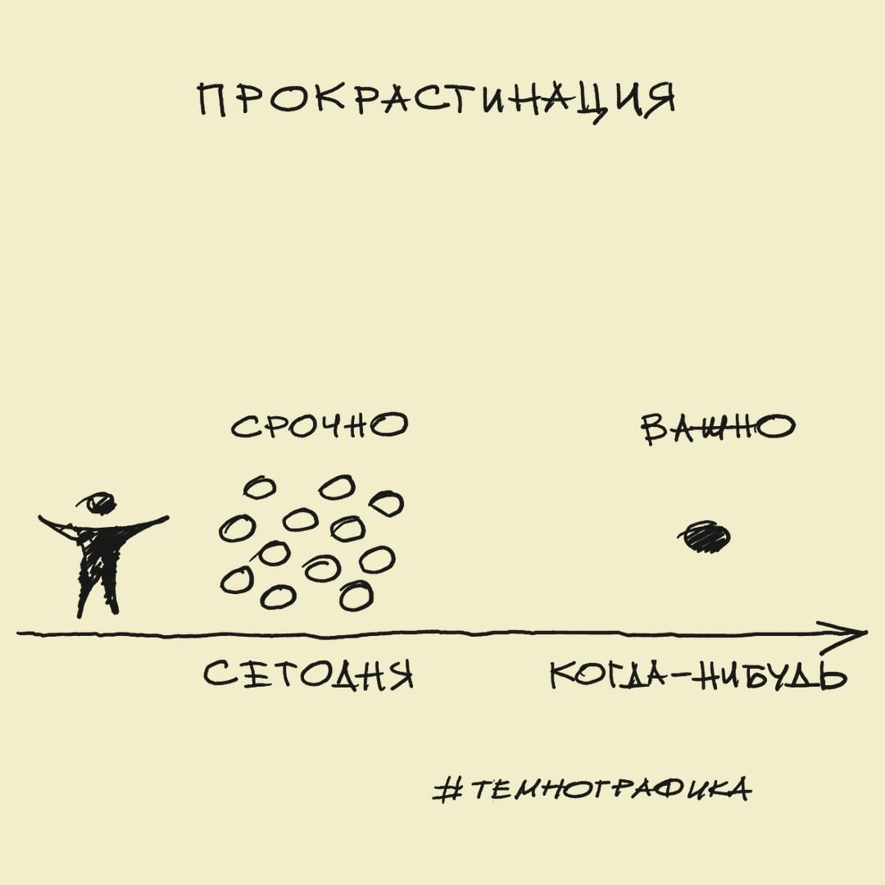
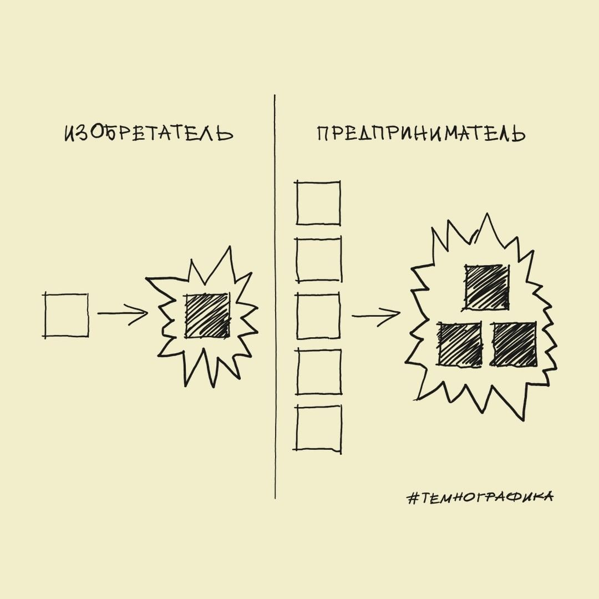

<h1>Поиск инвестора</h1>

**В проект, который можно описать так:**

- Есть затяжные доработки проектов (сайтов), на которые программисты впустую тратят время, а владельцы - деньги, по причине несогласованности кода, а точнее размытия целей по всему коду.
 
В: Насколько много людей? 

- Скорее все с этим сталкиваются.

В: Насколько регулярно? 

- Каждый день, ибо проще сделать костыли.

В: Как именно тратят?

- Владельцы не могут указать реализованные цели в проекте. Программисты не могут эти цели (сценарии отработки алгоритмов) быстро найти в коде. 

- Я предлагаю другой способ, как они могут удовлетворить эту потребность: framework (конструктор php-js-проекта) архитектуры кода, распределённой по компонентам: Conditions, Space, Distribution и Realization. Вот его описание: https://github.com/it-architector/framework.csdr

В: Какие у вас конкуренты – прямые, косвенные? 

- Все компании разрабатывающие "php-framework"и.

В: У нас, на Западе? 

- На западе, там их поддерживают.

В: Кто главный конкурент – конкретный продукт или «привычный способ делать это»?

- В Америке - финансирование и поддержка конкретного продукта, в России «привычный способ делать это», где "это" - следовать за Америкой.

- Этот способ лучше того, который сейчас используют люди, по критичному для этой потребности: среда разработки. 

В: Какие параметры для этой потребности критичны? 

- Читаемость кода, инструменты для работы, автоматизация программирования.

В: По какому из них вы лучше?

- По всем.

В: За счет чего вы лучше? 

- За счёт разработанных компонентов CSDR.

В: Что именно сделали по-другому? 

- Я спроектировал коммуникативно-конструкторский подход программирования, взамен текстово-консольному. 

В: Если есть нечестное преимущество, то в чем?

- Я использую в продукте изменения на рынке, в поведении людей и технологиях, которые начали происходить недавно из за образования "холакратии", способа децентрализации власти в компаниях. 

В: Что именно изменилось? 

- Появилась рабочая метода самоорганизации работников, под задачи компании, где есть возможность работникам выполнять "роли", прописываемые в регламенте.

В: Как это повлияло на возможность появления продукта именно сейчас? 

- Я сделал по аналогии холакратии протип framework life balance, и проанализировав, понял как можно строить понятный всем код конструктивно.

В: Почему его раньше никто не сделал?

- Не было реализованной идеи в качестве "роли работников".

**Текущее состояние проекта:**

- Архитектура готова. Есть уже образцы успешной реализации кода. Framework (констуктор) спроектирован. Нет ПО framework'a (который и будет монетизироваться) для операционных систем: windows, *nix, mac.

В: Кто и почему будет использовать ваш продукт?

- Заказчики сайтов и их программисты, которым нужен максимально-поддерживаемый код проекта и более скоростной и эффективный метод программирования.

В: Что люди перестали делать, начав пользоваться вашим продуктом?

- Тратить время на изучение кода из за "неосведомлённости" о проекте и смешивать в коде логику проекта с целями.

В: Что входит в стоимость для завершения проекта?

- Стоимость оплаты трудо-часов: 2-4 программистов.

В: Какие ключевые компетенции необходимы? 

- Для программистов на оплату - middle и senior в области написании ПО на windows, *nix, mac.

В: Насколько основатель вовлечен в деятельность проекта?

- Я полностью курирую архитектуру и планировку framework'a.

- В проекте нет инвесторов-фондов.

- Есть понимание, на что надо потратить инвестиции: подключить программистов для быстрой реализации. 

В: Без общих слов «на рекламу» или «на масштабирование». Сколько? На что? 

- 300.000 (+100.000) рублей в месяц на оплату 4-х программистов.

В: Для какого измеримого результата?

- 2 месяца - архитектура под конструктор. 5 (-2) месяцев - первый прототип конструктора проекта (с закрытым кодом).

**К чему хочу прийти:**

В: В чем и где вы собираетесь стать лидером? 

- В framework PHP и framework JS.

В: Какие рискованные гипотезы надо для этого проверить?

- Подойдёт ли js-framework для SEO.

В: Сколько мы с вами можем заработать? 

- $150 млн.

В: На чем заработаем? 

- На framework'e (кострукторе php-js-проектов).

В: Как прикинули эту сумму? 

- Прочитал статью о JetBrains (текстовом редакторе)  https://secretmag.ru/cases/interview/u-rossiiskoi-kompanii-jetbrains-vyruchka-usd150-mln-i-klient-google-vy-o-nei-slyshali.htm

В: При каких условиях это выполнимо?

- Программисты от 4-х человек: 1 php-js-программист, 3 c++ программисты (или другой язык для реализации программы на win,mac,nix). Реклама, видео-реклама, в том числе преимуществ самой архитектуры на практике.

Скажите, Вы готовы вложиться в проект?

**Контакты:**

Скайп: poryadok2017
Телеграм: it_architector
